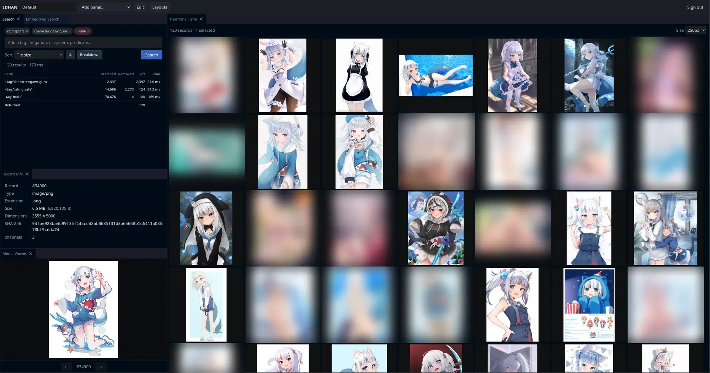
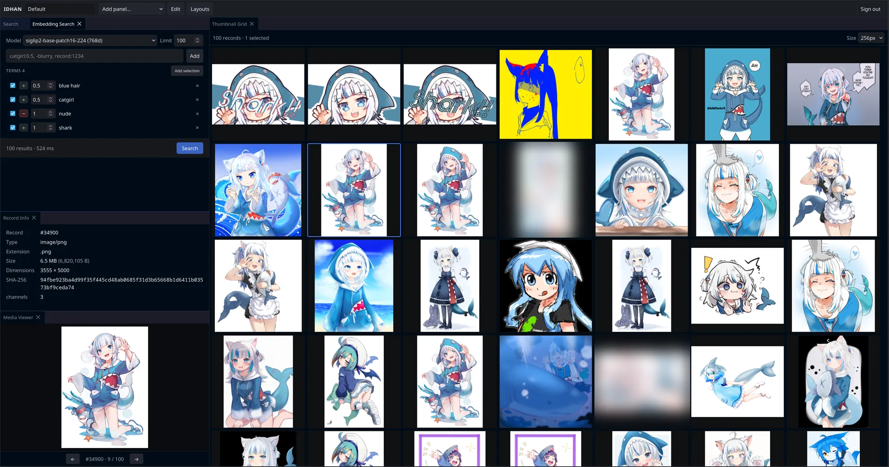
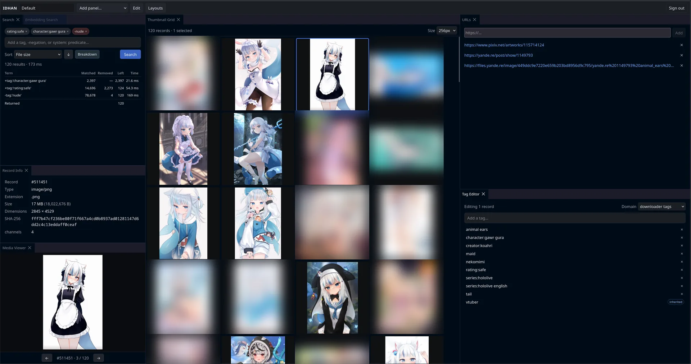
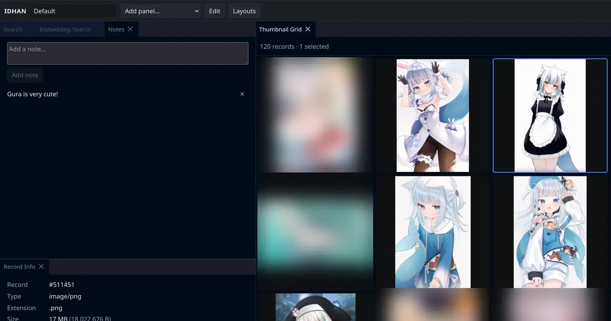
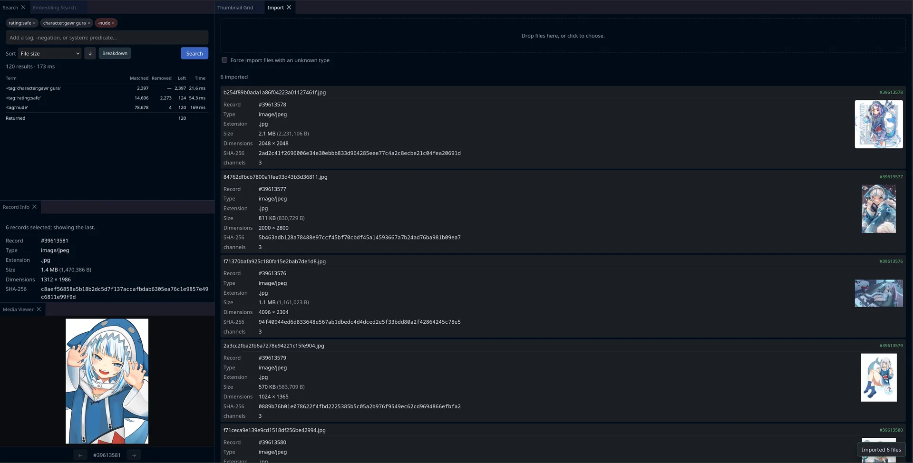
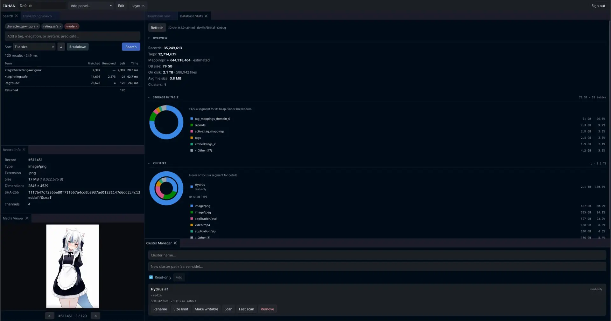

# IDHAN

IDHAN is a media management and archival server program written in C++ for people with large collections of media. It
uses the same style of tagging media files as sites like gelbooru and danbooru. The
recommended setup is to use docker and use the webui or a 3rd-party client

> AI use is allowed, But if you do not **HEAVILY REVIEW** the output, I will personally come and bust down your door.

IDHAN can be given modules to expand it's knowledge of files and eventually will be able to use more advanced parsing
methods using
python scripts.

Master: 
Dev: 

[Discord](https://discord.gg/YMYXS884cP)

Issues should be brought up [here](https://github.com/KJNeko/IDHAN/issues)

# Screenshots

<table>
<tr>
<td width="33%" align="center"> 1</td>
<td width="33%" align="center"> 2</td>
<td width="33%" align="center"> 3</td>
</tr>
<tr>
<td width="33%" align="center"> 4</td>
<td width="33%" align="center"> 5</td>
<td width="33%" align="center"> 6</td>
</tr>
</table>

# Features

- Media file imports
- Semantic Search (Using ONNX models)
- Tag search
- Tag Relationships system (Aliases, Parents/Children)
- Media metadata parsing
- Expandable mime types
- Expandable file metadata parsing
- Archive support
- Example WebClient
- Hydrus DB import tool
- Notes for for post descriptions
- Module based file thumbnailers
- HydrusAPI support

# Pending features

- Downloader support
- Python script based mime parsing
- Python script based metadata parsing
- Tag Sibling relationships (Directional Exclusive OR)

# Comparing to Hydrus

If you don't know what Hydrus is, Just skip this section

### Why should I use this over Hydrus?

If your library is small, You likely don't want to use IDHAN. Alternatively, if you are unhappy with the performance of
Hydrus, You
might want to try IDHAN. It's still recommended to use Hydrus currently for downloaders.

### Features that Hydrus lacks

- Semantic searching
- User modules for Metadata/Thumbnail/Mime processing
- A Server/Client seperation

### Features Hydrus has over IDHAN

- Downloaders.
- A way better UX.
- More tested and stable.
- Lack of needing to manage a DB

# Performance

I dunno, Works well enough on this piece of shit (Wyse 5070). Postgresql was the main bottleneck.

In all seriousness, Performance on a Pentium Silver J5005 @ 1.50Ghz was fairly usable when it was generating thumbnails
and importing files. Memory at worst is dependent on the files themselves and if you are using any embedding models for
semantic searching.

# Getting started

- [Docker Guide](docs/docker.md)
- [Building from source](docs/build.md) (Not recommended currently)
- [Configuration options](docs/config.md)
- [Quickstart guide](docs/setup.md) featuring config, TLS, and scanning your first cluster
- [Migrating from Hydrus](docs/migrating-from-hydrus.md)

# Server docs

The server listens on port **16609** by default. Interactive API docs (Swagger UI) are available at `/api` when the
server is running.

Additional documentation:

- [Database schema](docs/database-schema.md)
- [Tag system triggers](docs/tag-system-triggers.md)
- [Job system](docs/jobs.md)
- [WebUI plugins](docs/webui-plugins.md)
- [Known issues](docs/known-issues.md)
