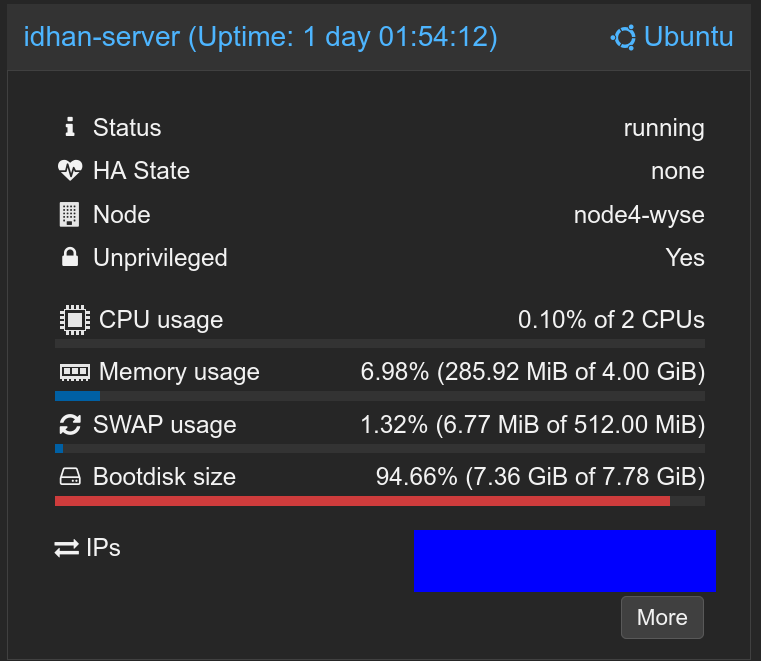

# IDHAN

IDHAN is a media management and archival server program written in C++ for people with large collections of media. It
uses the same style of tagging media files as sites like gelbooru and danbooru. The
recommended setup is to use docker and use the webui or a 3rd-party client

> AI use is allowed, But if you do not **HEAVILY REVIEW** the output, I will personally come and bust down your door.

IDHAN can be given plugins and modules to expand it's knowledge of files, It can be given new formats to
understand via mime parsing files, and eventually will be able to use more advanced parsing methods using
python scripts.

Master: 
Dev: 

# Features

- Media file imports
- Semantic Search (Using ONNX models)
- Tag search
- Tag Relationships system (Aliases, Parents/Children)
- Media metadata parsing
- Expandable mime types
- Expandable file metadata parsing
- Archive support
- Example WebClient
- Hydrus DB import tool
- Notes for for post descriptions
- Module based file thumbnailers
- HydrusAPI support

# Pending features

- Downloader support
- Python script based mime parsing
- Python script based metadata parsing
- Tag Sibling relationships (Directional Exclusive OR)

# Performance

I dunno, Works well enough on this piece of shit (Wyse 5070). Postgresql was the main bottleneck.

# Getting started

## Docker

For detailed docker instructions, please refer to the [Docker Guide](docs/docker.md).

## How to build

For detailed build instructions, please refer to our [Build Guide](docs/build.md).

## How to configure

For configuration options, check out our [Configuration Guide](docs/config.md).

## First run

[Getting started](docs/setup.md) covers the config values you need, creating and scanning your first cluster, and TLS
setup.

# Server docs

The server listens on port **16609** by default. Interactive API docs (Swagger UI) are available at `/api` when the
server is running.

A hosted version of the API docs is available at [idhan.futuregadgetlabs.net](https://idhan.futuregadgetlabs.net). (Once
I get this working that is)

Additional documentation:

- [Database schema](docs/database-schema.md)
- [Tag system triggers](docs/tag-system-triggers.md)
- [Job system](docs/jobs.md)
- [WebUI plugins](docs/webui-plugins.md)
- [Known issues](docs/known-issues.md)
